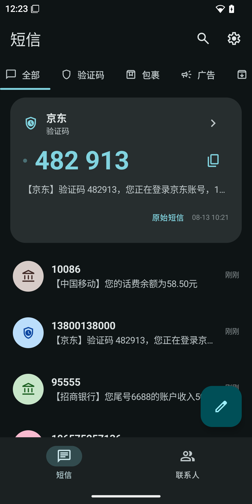
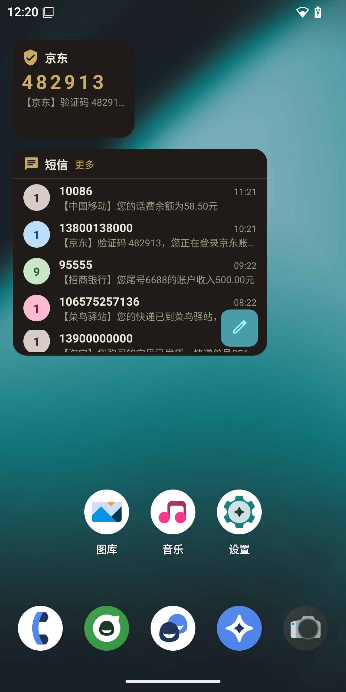

# LibreMessage(短信)

[English](README.md) · **中文**

一个对经典 **AOSP Messaging** 应用(`com.android.messaging`)的开源重新实现,
使用 Kotlin + Jetpack Compose 从零编写。简洁、现代的短信客户端,不含任何
Google 专有代码。

> **声明:** 本项目是基于原应用*可观察行为*的独立重实现,与 Google 无任何
> 关联或背书。"Messaging" 与 "Google" 均为其各自所有者的商标。

## 功能

- **短信收发** — 读取、发送、接收;内置验证码自动复制与广告短信静音
- **智能分类** — 会话自动归类为验证码、取件码(包裹)、广告与普通会话
- **会话界面** — Material 3 设计,消息气泡、首字母头像、长按多选批量
  复制 / 分享 / 删除
- **新建会话** — FAB 进入新会话模式,内置按号码过滤的联系人选择器
- **默认短信应用资格** — 完整角色认证(SMS_DELIVER、WAP_PUSH、
  RESPOND_VIA_MESSAGE)
- **联系人操作** — 从会话右上角菜单可将发件人添加到通讯录或屏蔽号码
- **国际化** — 界面内置英文与简体中文,随系统语言切换
- **彩信通知** — 收到彩信时弹出通知(暂不支持查看彩信内容)
- **防验证码轰炸** — 静音验证码通知、不在首页列表显示(智能 banner 保留),
  可临时放行 1 分钟并带倒计时
- **桌面小组件** — 验证码卡片(2×1 / 2×3)与最近会话列表(4×2,带联系人
  名字、彩色头像、点击直达聊天);收到新验证码实时刷新

## 截图



主界面 — 智能验证码 banner、分类标签与会话列表。



主屏上的会话列表小组件 — 最近会话,含联系人名字、彩色头像与消息预览。

## 构建

```bash
# Release 签名(可选,已 gitignore):
#   keystore.properties -> storeFile, storePassword, keyAlias, keyPassword
./gradlew :app:assembleRelease
```

APK 输出:`app/build/outputs/apk/release/app-release.apk`

## 致谢

`SmsParser` 中的匹配规则参考了两个开源项目:

- [otphelper](https://github.com/jd1378/otphelper) — 多语言验证码关键词表
  (code/OTP/验证码/コード/인증번호/код …)与数字归一化技巧
  (阿拉伯-印度数字、波斯数字、全角数字)
- [deliveries](https://github.com/itsvic-dev/deliveries) — 各快递公司
  运单号格式(EMS、DHL、UPS、4PX、InPost、顺丰 …),用于识别快递短信

`mms/pdu/` 下的 MMS PDU 编码器来自 AOSP `com.google.android.mms.pdu`
库(Apache-2.0,© The Android Open Source Project),原样复制并保留
原始许可头。

## 许可证

GPL-3.0 — 见 [LICENSE](LICENSE)。
